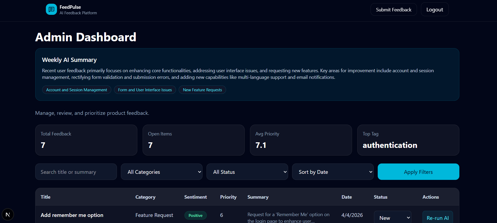
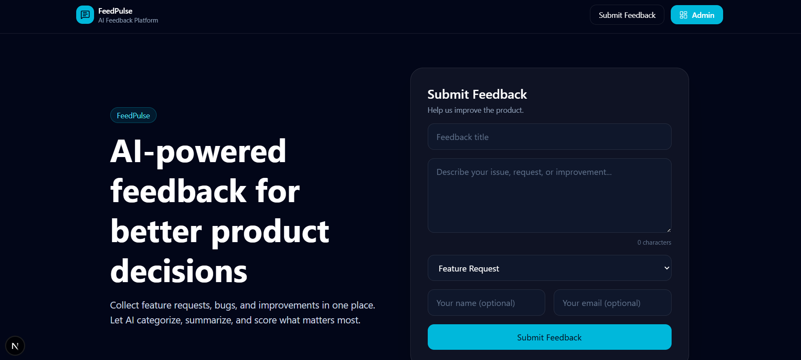
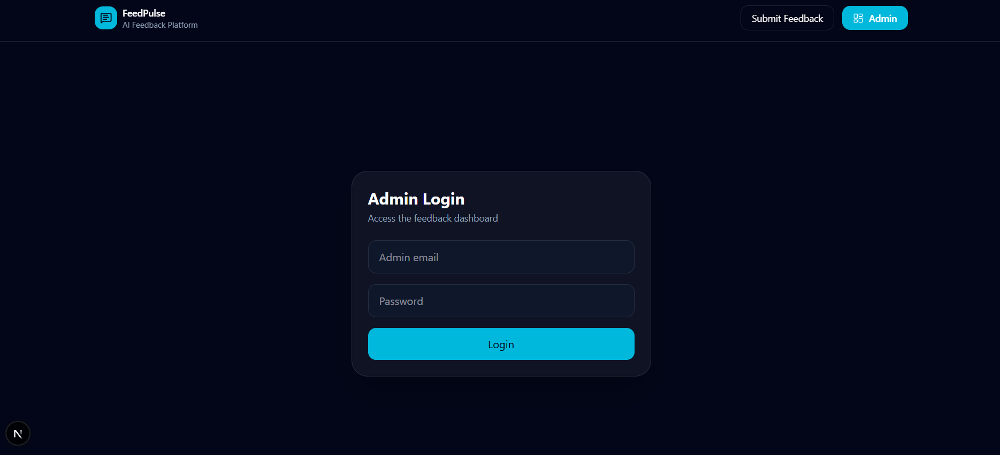

# FeedPulse – AI-Powered Feedback Management System

FeedPulse is a full-stack web application that allows users to submit product feedback and enables administrators to analyze, prioritize, and manage feedback using AI-powered insights.

---

## Project Overview

FeedPulse provides:

A public feedback submission form
An admin dashboard for managing feedback
AI-powered analysis (sentiment, priority, summary, tags)
Weekly AI summary insights
Filtering, sorting, and pagination
Secure admin access

---

## Tech Stack

### Frontend

Next.js (App Router)
TypeScript
Tailwind CSS
Axios

### Backend

Node.js + Express
TypeScript
MongoDB + Mongoose

### AI Integration

Google Gemini API (`@google/generative-ai`)

---

## Setup Instructions

### 1️Clone the Repository

```bash
git clone https://github.com/sudeepa99/Feed-Pulse_Product-Feedback-Platform
cd feedpulse
```

---

## Backend Setup

```bash
cd backend
npm install
```

### Create `.env` file

```env
PORT=4000
MONGO_URI=your_mongodb_connection_string
JWT_SECRET=your_secret_key
GEMINI_API_KEY=your_gemini_api_key
```

### Run Backend

```bash
npm run dev
```

Backend runs at:
[http://localhost:4000](http://localhost:4000)

---

## Frontend Setup

```bash
cd frontend
npm install
npm run dev
```

Frontend runs at:
[http://localhost:3000](http://localhost:3000)

---

## Admin Login

**Default credentials:**

Email: `admin@feedpulse.com`
Password: `admin123`

---

## Features

### Public Feedback Form

Submit feedback with:

Title
Description
Category
Optional name/email
Validation:

Required fields
Minimum description length
Rate limiting (max 5 submissions/hour)

---

### AI Processing

Each feedback is automatically analyzed using Gemini:

Sentiment (Positive / Neutral / Negative)
Priority score (1–10)
AI-generated summary
Tags

---

### Admin Dashboard

Secure login (JWT-based)
View all feedback
Filter by:

Category
Status
Search
Sort by:

Date
Priority
Sentiment
Pagination support

---

### Re-trigger AI Analysis

Re-run AI analysis for any feedback item.

Updates:

Sentiment
Priority
Summary
Tags

---

### Stats Bar (Full Data)

Displays:

Total feedback count
Open items
Average priority
Most common tag

Uses backend aggregation (not just current page)

---

### Weekly AI Summary

Summarizes feedback from the last 7 days:

Key themes
Overall insights

---

## API Endpoints

### Public

```
POST /api/feedback
```

### Admin (Protected)

```
POST   /api/auth/login
GET    /api/feedback
GET    /api/feedback/:id
PATCH  /api/feedback/:id
DELETE /api/feedback/:id
POST   /api/feedback/:id/reanalyze
GET    /api/feedback/summary
GET    /api/feedback/stats
```

---

## Security Features

JWT authentication
Protected admin routes
Input validation (`express-validator`)
Rate limiting on feedback submission
Input sanitization

---

## UI Features

Fully responsive design
Mobile-friendly dashboard
Clean Tailwind UI
Loading states & disabled actions
Empty state handling

---

## Screenshots

## Screenshots





---

## License

This project is for educational purposes.

---

## Author

Developed as part of a full-stack assignment.

---
